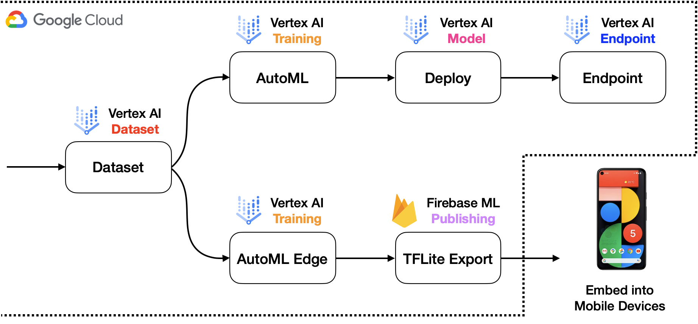

# Dual-Deployments-on-Vertex-AI

_By Chansung Park and Sayak Paul_

This project demonstrates a workflow to cover dual model deployment scenarios using [Kubeflow](https://www.kubeflow.org/),
[TensorFlow Extended (TFX)](https://www.tensorflow.org/tfx), and [Vertex AI](https://cloud.google.com/vertex-ai). We suggest
reading the accompanying blog post (coming soon) first to get an idea and then following along with the code.

## Motivation 💻

Let's say you want to allow your users to run an application both in online and offline mode. Your mobile
application would use a TFLite model depending on the network bandwidth/battery etc., and if sufficient
network coverage/internet bandwidth is available your application would instead use the online cloud one. This way
your application stays resilient and can ensure high availability.

Sometimes we also do layered predictions where we first divide a problem into smaller tasks:
1) predict if it's a yes/no, 2) Depending on the output of 2) we run the final model. 

In these cases, 1) takes place on-device and 2) takes place on the cloud to ensure a smooth UX. Furthermore, it's
a good practice to use a mobile-friendly network architecture (such as MobileNet) when considering
mobile deployments. This leads us to the following question: 

_**Can we train two different models within the same deployment pipeline and manage them seamlessly?**_

This project is motivated by this question.  

## AutoML, TFX, etc. 🛠

Different organizations have people with varied technical backgrounds. We wanted to provide the easiest solution first
and then move on to something that is more customizable. To this end, we leverage [Kubeflow's AutoML SDKs](https://github.com/kubeflow/pipelines/tree/master/components/google-cloud) to build, train, and deploy models with 
different production use-cases. With AutoML, the developers can delegate a large part of their workflows to the SDKs
and the codebase also stays comparatively smaller. The figure below depicts a sample system architecture for
this scenario:



**<sup>Figure developed by <a href="https://github.com/deep-diver">Chansung Park.</a></sup>**

But the story does not end here. What if we wanted to have better control over the models to be built, trained,
and deployed? Enter TFX! TFX provides the flexibility of writing custom components and including them inside a
pipeline. This way Machine Learning Engineers can focus on building and training their favorite models and delegate
a part of the heavy lifting to TFX and Vertex AI. On Vertex AI (acting as an orchestrator) this pipeline will look like
so:


```txt
🔥 In this project we cover both these situations. 
```

## Code 🆘

Our code is distributed as Colab Notebooks. But one needs to have a billing-enabled GCP account 
(with a few APIs enabled) to successfully run these notebooks. Alternatively one can also use the
notebooks on  [Vertex AI Notebooks](https://cloud.google.com/vertex-ai/docs/general/notebooks). Find
all the notebooks and their descriptions here: 
[`notebooks`](https://github.com/sayakpaul/Dual-Deployments-on-Vertex-AI/tree/main/notebooks).

Additionally, we plan to release the custom components in a separate directory inside this repository
for easier reference.

## Acknowledgements

[ML-GDE program](https://developers.google.com/programs/experts/) for providing GCP credits.
